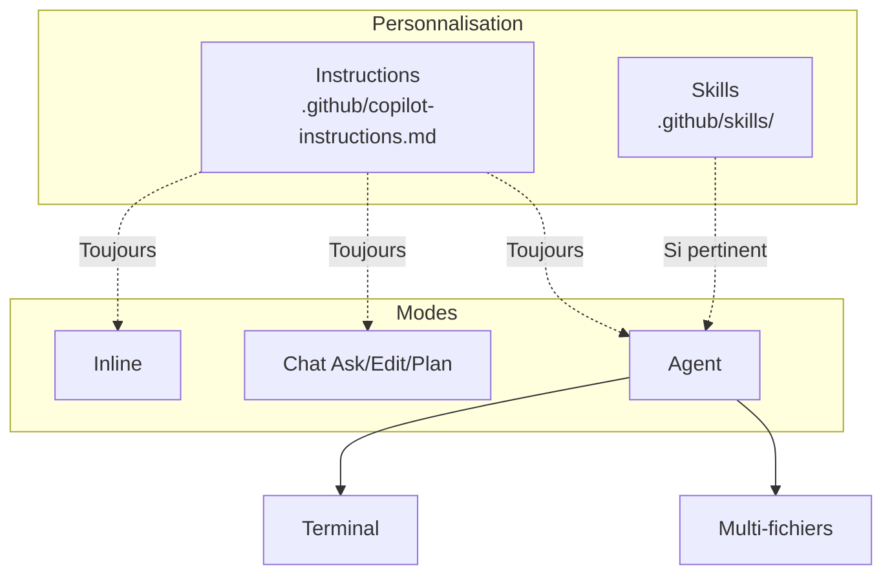

# Introduction — Développer en Python avec GitHub Copilot

Bienvenue dans la formation **GitHub Copilot** pour développeurs **Python**.

Cette formation couvre l utilisation de GitHub Copilot au quotidien : completions inline, Chat, personnalisation du dépôt et bonnes pratiques de validation du code généré.

## Public et prérequis

| Prérequis | Détail |
| --------- | ------ |
| Développement | Savoir lire et écrire du code **Python** |
| Git / GitHub | Compte GitHub, notions de dépôt et commit |
| Éditeur | Visual Studio Code (recommandé) |
| Copilot | Abonnement actif (Individual, Business ou Enterprise) |

## Objectifs globaux

- Utiliser les completions inline avec des prompts précis.
- Maîtriser Copilot Chat (Ask, Edit, Plan, Agent).
- Personnaliser le dépôt avec Instructions et Skills.
- Configurer path-specific, commits et revues assistées.
- Appliquer une checklist de validation sur le code généré.

## Organisation — 6 modules

| Module | Thème | Durée |
| ------ | ----- | ----- |
| 1 | Introduction à GitHub Copilot | 2 h |
| 2 | Completions inline et contexte | 3 h |
| 3 | Chat et modes d'interaction | 3 h |
| 4 | Agent, Skills et Instructions | 4 h |
| 5 | Path-specific, commit et review | 3 h |
| 6 | Bonnes pratiques et productivité | 2 h |

Chaque module comprend un **cours**, des **exercices** et une **correction**.


**Prochaine étape :** [Module 1 — Introduction](/formations/fr-github-copilot-python/module-01-introduction)

---

# Module 1 — Introduction à GitHub Copilot

Ce module pose les bases de GitHub Copilot pour le développement en **Python** : comprendre l'outil, choisir le bon mode, et vérifier l'installation dans VS Code.

**Durée indicative :** 2 h.

## Objectifs

- Définir GitHub Copilot et son rôle de pair-programmer virtuel.
- Distinguer inline, Chat, Agent et CLI.
- Installer et configurer Copilot dans VS Code.
- Consulter les statistiques d'utilisation.

---

> [!note] Définition — GitHub Copilot
> Assistant IA intégré à l'éditeur. Analyse le **contexte** (fichiers, commentaires, sélection) et propose des **suggestions** en temps réel.

## 1.1 Qu'est-ce que GitHub Copilot ?

GitHub Copilot est un assistant de programmation basé sur l'intelligence artificielle, développé par GitHub en collaboration avec OpenAI. Il fonctionne comme un **pair-programmer virtuel** intégré directement dans l'éditeur de code.

**Principe de fonctionnement :**

- Copilot analyse le contexte du code en cours d'écriture (fichiers ouverts, commentaires, noms de variables)
- Il génère des suggestions de code en temps réel, directement dans l'éditeur
- Le modèle sous-jacent a été entraîné sur des milliards de lignes de code provenant de dépôts publics GitHub
- Il est particulièrement efficace en Python grâce à l'écosystème massif open source (Django, FastAPI, Flask, data science, automatisation, etc.)

**Ce que Copilot n'est pas :**

- Ce n'est pas l'interpréteur Python ni mypy/ruff
- Il ne garantit pas que le code généré est correct ou sécurisé
- Il ne remplace pas la compréhension du langage Python et des bonnes pratiques PEP

## 1.2 Les différentes versions — du complétion à l'agent

GitHub Copilot propose plusieurs **niveaux d'autonomie**. La formation s'articule autour du mode **Agent** et de sa personnalisation (**Instructions**, **Skills**), tout en conservant les **completions inline** pour l'écriture au fil de l'eau.

| Version | Niveau d'autonomie | Description | Usage principal |
| -------------------- | ------------------ | ---------------------------------------------- | --------------------------------------- |
| **Copilot (inline)** | Faible | Suggestions de code directement dans l'éditeur | Complétion au quotidien, boilerplate |
| **Copilot Chat** | Moyen | Conversation (Ask, Edit, Plan) | Questions, explications, refactoring |
| **Mode Agent** | Élevé | Planifie, modifie plusieurs fichiers, exécute | Tâches multi-fichiers, debug, migration |
| **Copilot CLI** | Élevé | Agent en ligne de commande | Shell, tests, CI, scripts |

**Copilot inline** reste le point d'entrée : dès qu'on tape du code, des suggestions apparaissent en gris (`Tab` pour accepter). Voir le **Module 2**.

**Copilot Chat** couvre Ask, Edit, Plan et Agent. Voir le **Module 3**.

**Instructions, Skills et mode Agent** : voir les **Modules 4 et 5**.

**Copilot CLI** (`gh copilot`) reprend la logique agentique hors de l'éditeur — utile pour lancer les tests (`pytest`), typer (`mypy`) ou formater (`ruff format`).

## 1.3 Installation et configuration

**Prérequis :**

- Un compte GitHub avec un abonnement Copilot actif (Individual, Business ou Enterprise)
- Visual Studio Code installé
- Extension **Python** de Microsoft + **Pylance** (typage et IntelliSense)

**Étapes d'installation :**

1. Ouvrir VS Code
2. Aller dans Extensions (`Ctrl + Shift + X`)
3. Rechercher "GitHub Copilot" et installer l'extension
4. Installer également "GitHub Copilot Chat"
5. Se connecter à GitHub quand VS Code le demande
6. Vérifier l'icône Copilot dans la barre de statut (en bas)

**Vérification du fonctionnement :**
Créer un fichier `test.py` et commencer à taper :

```python
def greet(name: str) -> str:
 """Affiche un message de bienvenue."""
```

Si Copilot fonctionne, une suggestion devrait apparaître en gris pour compléter la fonction.

## 1.4 Interface et statistiques d'utilisation

Pour consulter les statistiques d'utilisation de Copilot :

- Cliquer sur l'icône Copilot dans la barre de statut de VS Code
- Accéder au tableau de bord via GitHub : `Settings > Copilot > Usage`
- Les métriques disponibles : taux d'acceptation des suggestions, lignes de code générées, langages les plus utilisés

En entreprise (Copilot Business/Enterprise), les administrateurs ont accès à un dashboard détaillé montrant le pourcentage d'utilisation par équipe et par développeur.

---

---

# Module 2 — Completions inline et contexte

Dans le [module 1](/formations/fr-github-copilot-python/module-01-introduction), nous avons installé Copilot. Les **completions inline** accélèrent l'écriture du boilerplate Python (fonctions utilitaires, tests). Ce module approfondit raccourcis, contexte et commentaires-prompt.

**Durée indicative :** 3 h.

## Objectifs

- Maîtriser les raccourcis clavier des suggestions inline.
- Expliquer la fenêtre de contexte et ses limites.
- Rédiger des commentaires-prompts (Quoi / Comment / Contraintes).
- Itérer : alternatives, acceptation partielle, reformulation.

---

Les **completions inline** sont le mode le plus utilisé au quotidien. Une fois les **Instructions** configurées (Module 4), elles produisent des suggestions alignées sur les standards du projet Python.

> [!note] Définition — Complétion inline
> Suggestion affichée **en gris** pendant la frappe. Acceptez (`Tab`), rejetez (`Échap`) ou parcourez les alternatives.

## 2.1 Raccourcis clavier essentiels

| Action | Raccourci (Windows/Linux) | Raccourci (Mac) |
| -------------------------------- | ------------------------- | --------------- |
| Accepter la suggestion | `Tab` | `Tab` |
| Rejeter la suggestion | `Échap` | `Échap` |
| Suggestion suivante | `Alt + ]` | `Option + ]` |
| Suggestion précédente | `Alt + [` | `Option + [` |
| Accepter le mot suivant | `Ctrl + →` | `Cmd + →` |
| Déclencher manuellement | `Alt + \` | `Option + \` |
| Ouvrir le panneau de suggestions | `Ctrl + Enter` | `Ctrl + Enter` |

Le panneau de suggestions (`Ctrl + Enter`) ouvre une fenêtre avec jusqu'à 10 suggestions alternatives. Utile quand la première suggestion ne convient pas.

## 2.2 Déclencher des suggestions

### Commencer à taper une signature de fonction

```python
def calculate_factorial(n: int) -> int:
```

Copilot va proposer le corps de la fonction en se basant sur le nom explicite et les types.

### Écrire un commentaire descriptif

```python
def bubble_sort(arr: list[int]) -> list[int]:
 """Tri à bulles, retourne une nouvelle liste triée."""
```

Le commentaire guide Copilot sur l'algorithme attendu.

### Créer une structure de données

```python
@dataclass
class Employee:
 name: str
 age: int
 salary: float
```

Copilot pourra suggérer des méthodes cohérentes (__str__, from_dict, to_dict, etc.).

### Nommer une variable de manière explicite

```python
max_retry_count = 3
error_message: str | None = None
input_file = open("data.csv", encoding="utf-8")
```

Des noms de variables clairs aident Copilot à comprendre l'intention du code.

## 2.3 Le contexte compte

Copilot ne se base pas uniquement sur la ligne en cours. Il analyse un **contexte élargi** :

**Les fichiers ouverts dans l'éditeur :**
Si vous avez `models.py` ouvert avec des dataclasses, Copilot les utilisera pour générer des services cohérents dans `services.py`.

**Les imports influencent les suggestions :**

```python
from fastapi import APIRouter # Copilot suggère des endpoints REST
import pandas as pd # Copilot suggère du traitement de données
import asyncio # Copilot suggère du code async
```

**Le code environnant guide la génération :**
Si les fonctions précédentes utilisent un style particulier (gestion d'erreurs, patterns async, immutabilité), Copilot va reproduire ce pattern.

```python
# Si votre code existant fait ceci :
try:
 result = fetch_data(url)
except RequestError as exc:
 logger.error("Échec requête %s: %s", url, exc)
 raise

# Copilot reproduira ce pattern de gestion d'erreur
```

## 2.4 La fenêtre de contexte (context window)

La **fenêtre de contexte** (ou _context window_) est la quantité maximale de texte — code, commentaires, historique de chat, instructions du projet — que le modèle peut prendre en compte **en une seule requête**.

**Définition concrète :**

- Tout ce que Copilot « voit » avant de répondre occupe cette fenêtre : fichiers ouverts, sélection, messages du chat, `@workspace`, instructions Copilot, etc.
- Cette limite se mesure en **tokens** (morceaux de texte), pas en lignes de code.
- Au-delà de la limite, le contenu le plus ancien ou le moins prioritaire est **tronqué**.

**Pourquoi c'est important :**

| Conséquence | Explication |
| --------------------------------- | ----------- |
| **Perte de contexte** | Un gros fichier + historique chat peuvent faire « oublier » le début. |
| **Suggestions moins cohérentes** | Si vos conventions ne tiennent plus dans la fenêtre, Copilot revient à des patterns génériques. |
| **Réponses incomplètes en Agent** | Sur un gros dépôt, l'agent doit cibler les bons fichiers. |
| **Coût de qualité du prompt** | Un contexte pertinent vaut mieux qu'un contexte volumineux. |

**Bonnes pratiques pour optimiser la fenêtre :**

- Garder ouverts uniquement les fichiers **pertinents** (ex. `models.py` + `services.py`, pas tout le projet).
- Poser des questions **ciblées** dans le chat plutôt que de coller des milliers de lignes.
- Utiliser `#file:src/services/parser.py` pour un fichier précis plutôt que `#workspace` quand la question est locale.
- Découper les grosses refontes en étapes (module par module).
- Centraliser les règles du projet dans les **Instructions** (voir Module 4).

## 2.5 L'art du commentaire-prompt

En Python, les docstrings et les type hints guident Copilot.

**Commentaire vague → résultat imprécis :**

```python
# trier le tableau
```

**Commentaire précis → résultat ciblé :**

```python
def insertion_sort(arr: list[int]) -> list[int]:
 """Tri par insertion, ordre croissant. O(n²) pire cas. Retourne une copie."""
```

## 2.6 Principes de base

**Être spécifique et précis :**

```python
# ❌ Vague
# lire un fichier

# ✅ Précis
def read_lines(file_path: str) -> list[str]:
 """Lit un fichier texte ligne par ligne. Lève FileNotFoundError si absent."""
```

**Donner du contexte :**

```python
def find_free_block(size: int) -> memoryview | None:
 """Recherche un bloc libre dans la free list (stratégie first-fit)."""
```

**Décomposer les problèmes complexes :**

```python
def parse_csv_line(line: str) -> list[str]: ...
def token_to_employee(tokens: list[str]) -> Employee: ...
def insert_employee(employees: list[Employee], emp: Employee) -> list[Employee]: ...
```

**Itérer sur les suggestions :**
Si la première suggestion ne convient pas, utiliser `Alt + ]` pour voir les alternatives, ou reformuler le commentaire.

## 2.7 Structure d'un bon prompt

Un prompt efficace suit la structure **Quoi / Comment / Contraintes** :

```python
def binary_search(arr: list[int], target: int) -> int:
 """
 QUOI : Recherche dans un tableau trié
 COMMENT : Dichotomie
 CONTRAINTES : arr trié croissant ; retourne l'index ou -1
 """
```

Autre exemple :

```python
def deep_copy_list(head: Node | None) -> Node | None:
 """
 QUOI : Copie profonde d'une liste chaînée
 COMMENT : Parcours itératif, nouveaux nœuds
 CONTRAINTES : retourne None si head est None ; pas de mutation de l'original
 """
```

## 2.8 Itération et raffinement

**Accepter partiellement une suggestion :**
Utiliser `Ctrl + →` (accepter mot par mot) quand le début de la suggestion est bon mais la suite diverge.

**Modifier et relancer pour affiner :**

```python
# Premier essai — bubble sort basique
# Trier un tableau

# Deuxième essai — plus précis
def quicksort(arr: list[int]) -> list[int]:
 """Quicksort, pivot médian, fallback insertion si len < 10."""
```

**Combiner plusieurs suggestions :**
Accepter une suggestion pour le squelette, puis supprimer certaines parties et redemander avec un commentaire plus spécifique.

---

---

# Module 3 — Chat et modes d'interaction

Après les [completions inline](/formations/fr-github-copilot-python/module-02-completions-inline), ce module présente **Copilot Chat** pour diagnostiquer des bugs et planifier des refactorings Python.

**Durée indicative :** 3 h.

## Objectifs

- Utiliser les modes Ask, Edit, Plan et Agent.
- Sélectionner le contexte (@workspace, #file, sélection).
- Employer les commandes slash (/explain, /fix, /tests).
- Comprendre l'indexation sémantique du dépôt.

---

## 3.1 Les modes du Chat — Ask, Edit, Plan, Agent

Copilot Chat propose plusieurs **modes** selon le niveau d'autonomie souhaité. Ils partagent les **Instructions** du projet ; seuls **Agent** et partiellement **Ask** exploitent les **Skills** (voir Module 4).

| Mode | Autonomie | Comportement | Exemple en Python |
| ---------- | --------- | ------------------------------------------------- | ------------------------------------------------- |
| **Ask** | Faible | Répond, explique, ne modifie pas les fichiers | « Explique ce décorateur et son ordre d'application » |
| **Edit** | Moyenne | Modifie le code sélectionné ou le fichier actif | « Ajoute les type hints manquants sur cette fonction » |
| **Plan** | Moyenne | Produit un plan détaillé avant d'agir | « Plan pour migrer ce module vers async/await » |
| **Agent** | Élevée | Planifie, édite, exécute, itère | « Corrige toutes les erreurs mypy sur src/ » |

**Ask** — comprendre du code sans modification :

- Sélectionner un bloc, poser une question : « Pourquoi j'ai une RecursionError ici ? »
- Les Instructions s'appliquent (ex. réponse alignée sur vos conventions docstring Google/NumPy)

**Edit** — changements localisés :

- Sélectionner une fonction, demander « /fix » ou une modification ciblée
- Plus rapide que l'Agent pour une modification ponctuelle

**Plan** — grosses tâches :

- Copilot produit un plan numéroté ; vous validez avant passage en Agent

**Agent** — cœur de l'approche agentique (voir Module 4) :

- Accès terminal, multi-fichiers, index sémantique
- Active automatiquement les **Skills** pertinents

## 3.2 Interface conversationnelle

Ouvrir le panneau Chat : `Ctrl + Shift + I` (ou `Cmd + Shift + I` sur Mac).

**Exemples de questions utiles en Python :**

- "Explique-moi ce générateur et son yield"
- "Pourquoi ce dataclass n'est pas hashable ?"
- "Comment implémenter un endpoint FastAPI avec validation Pydantic ?"
- "Génère les tests pytest pour cette fonction"
- "Optimise cette boucle pandas pour réduire les copies"

**Obtenir des explications détaillées :**
Sélectionner un bloc de code complexe puis demander dans le chat :
"Explique ce code étape par étape, en particulier la gestion des exceptions et les type hints"

## 3.3 Commandes slash

| Commande | Action |
| ---------- | --------------------------------------------------- |
| `/explain` | Explique le code sélectionné |
| `/fix` | Propose une correction pour le code sélectionné |
| `/tests` | Génère des tests pour le code sélectionné |
| `/doc` | Génère la documentation (docstrings Google ou NumPy) |
| `/new` | Crée un nouveau fichier/projet |
| `/clear` | Efface l'historique du chat |

**Exemple avec `/doc` :**

```python
def add_node(linked_list: LinkedList, data: object) -> int:
```

```python
def add_node(linked_list: LinkedList, data: object) -> int:
 """
 Ajoute un nœud en tête de la liste chaînée.

 Args:
 linked_list: Liste cible.
 data: Données à stocker.

 Returns:
 Index du nœud créé, ou -1 en cas d'erreur.
 """
```

## 3.4 Sélection de contexte

Surligner un bloc de code, puis ouvrir le chat → Copilot comprend que la question porte sur ce code précis.

## 3.5 Indexation sémantique du codebase

L'**indexation sémantique** permet à Copilot de **comprendre le sens** du code du projet, pas seulement de faire correspondre des mots-clés.

**Principe :**

- Le dépôt est analysé en embeddings : fonctions, types, commentaires, relations entre fichiers.
- Une question du type « Où est gérée la validation ? » ou `@workspace trouve les handlers dupliqués` s'appuie sur cette index.
- Les résultats pertinents sont injectés dans la fenêtre de contexte.

| Approche | Limite |
| --------------------------------- | ------ |
| Fichiers ouverts + ligne courante | Ne couvre que ce que vous avez sous les yeux |
| Recherche par nom de symbole | Rate les implémentations sous un autre nom |
| **Index sémantique** | Retrouve du code par **intention** (« parsing CSV », « session SQLAlchemy », « gestion d'erreur HTTP ») |

**Bonnes pratiques :**

- Laisser l'indexation se terminer après un clone ou un gros pull.
- Formuler des requêtes avec des **concepts** (« dataclass », « générateur », « context manager »).
- Combiner index sémantique + `#file:src/services/parser.py`.

## 3.6 Mode Agent en pratique

Le **mode Agent** est le point d'application des **Skills** et **Instructions** configurés au Module 4.

Copilot peut :

- Exécuter des commandes terminal (`pytest`, `mypy`, `ruff check`, `python -m`)
- Modifier plusieurs fichiers en séquence
- Itérer jusqu'à résoudre un problème ou signaler un blocage

```
Mode Agent : « Corrige toutes les erreurs mypy et ruff sur src/ »
→ Copilot active le skill type-and-lint (si présent)
→ Applique les Instructions (PEP 8, type hints)
→ Lance mypy et ruff, corrige les fichiers, relance pytest
```

**Bonnes pratiques Agent :**

- Formuler un **objectif mesurable** (« 0 erreur mypy et ruff sur src/ »)
- Laisser l'indexation sémantique se terminer sur les gros dépôts
- Vérifier manuellement le diff avant commit

## 3.7 Mode Cloud (aperçu)

Le mode Cloud permet d'exécuter des tâches Copilot sur l'infrastructure GitHub :

- Tâches longues en arrière-plan
- Pas besoin de garder VS Code ouvert
- Résultats via notification ou PR
- Utile pour des refactorings massifs ou des migrations

---

---

# Module 4 — Agent, Skills et Instructions

Dans le [module 3](/formations/fr-github-copilot-python/module-03-chat-modes), nous avons exploré le Chat. Ce module détaille la **personnalisation agentique** : Instructions, Skills et mode Agent.

**Durée indicative :** 4 h.

## Objectifs

- Rédiger `.github/copilot-instructions.md` adapté au projet Python.
- Créer un Skill métier (lint, tests, typecheck).
- Lire le schéma Instructions → Skills → Agent.
- Tester la personnalisation en mode Agent.

---

> [!note] Définition — Instructions
> Règles **permanentes** du dépôt, injectées à chaque interaction (inline, chat, agent). Fichier principal : `.github/copilot-instructions.md`.

> [!note] Définition — Instructions
> Règles **permanentes** du dépôt, injectées à chaque interaction (inline, chat, agent). Fichier : `.github/copilot-instructions.md`.

## 4.1 Vue d'ensemble

| Concept | Rôle | Quand c'est actif | Fichier typique |
| ------- | ---- | ----------------- | --------------- |
| **Instructions** | Règles permanentes du projet | **Toujours** (inline, chat, agent) | `.github/copilot-instructions.md` |
| **Skill** | Workflow spécialisé, chargé à la demande | Quand la tâche correspond à la description | `.github/skills/<nom>/SKILL.md` |
| **Agent** | Mode autonome qui planifie et exécute | Sur demande explicite (mode Agent) | Panneau Chat ou Copilot CLI |

Les **Instructions** définissent _comment coder dans ce dépôt_. Les **Skills** enseignent _comment accomplir une tâche répétitive_. L'**Agent** _orchestre_ le tout.

| | Instructions | Skill |
| --- | --- | --- |
| **Contenu** | Règles courtes, standards du projet | Workflow détaillé, scripts, références |
| **Activation** | Toujours | Seulement si la tâche est pertinente |

## 4.2 Instructions globales — `.github/copilot-instructions.md`

Fichier à la racine du dépôt (dossier `.github/`). Copilot l'injecte dans **toutes** les interactions.

| Fichier | Portée |
| ------- | ------ |
| `.github/copilot-instructions.md` | Global — tout le dépôt |
| `.github/instructions/*.md` | Par chemin (`applyTo` en en-tête YAML) |
| Instructions personnelles | GitHub → Settings → Copilot (tous vos projets) |

**Exemple :**

```markdown
# Instructions — projet Python

- Python 3.11+ ; type hints sur l'API publique
- snake_case fonctions/variables ; PascalCase classes
- Docstrings Google style sur fonctions publiques
- `pytest` pour les tests ; `ruff` pour le lint
- Vérifier les retours `None` implicites et les exceptions documentées
```

**Bonnes pratiques :**

- Rester **court** (≤ 200 lignes) — le détail va dans un Skill ou une instruction path-specific (module 5).
- Documenter _pourquoi_ une règle existe, pas seulement _quoi_.
- Consignes pédagogiques : ne pas compléter les zones à implémenter des exercices.

> Les Instructions restent **générales**. Pour un workflow détaillé, préférer un **Skill**.

## 4.3 Skills — `.github/skills/<nom>/SKILL.md`

> [!note] Définition — Skill
> Dossier avec `SKILL.md` (frontmatter `name`, `description`). Copilot charge le skill **quand la tâche correspond** à la description YAML.

**Structure :**

```
.github/skills/
└── lint-and-check/
 ├── SKILL.md
 ├── scripts/
 └── references/
```

**Exemple `SKILL.md` :**

```markdown
---
name: lint-and-check
description: Exécute ruff et pytest. Utiliser quand l'utilisateur mentionne lint, pytest, mypy ou erreur de test.
---

## Workflow

1. `ruff check .` puis `mypy src/`
2. `pytest` sur le package concerné
3. Corriger imports et types
4. Itérer jusqu'à 0 erreur
```

| Action | Documentation |
| ------ | ------------- |
| Créer un skill | [About agent skills](https://docs.github.com/copilot/concepts/agents/about-agent-skills) |
| Instructions dépôt | [Repository custom instructions](https://docs.github.com/copilot/customizing-copilot/adding-repository-custom-instructions-for-github-copilot) |

## 4.4 Mode Agent en pratique

Le **mode Agent** (Module 3) est le point d'application des Instructions et Skills configurés ci-dessus.

**Capacités :**

- Exécuter des commandes terminal (`pytest, ruff check, mypy`)
- Modifier plusieurs fichiers en séquence
- Itérer jusqu'à un objectif mesurable ou signaler un blocage

**Exemple :**

```
Mode Agent : « Corrige toutes les erreurs ruff et mypy sur src/ »
→ Lance ruff et pytest, corrige, relance
```

**Bonnes pratiques :**

- Objectif **mesurable** (« 0 warning gcc », « tests verts »)
- Vérifier le diff avant commit
- Laisser l'indexation sémantique se terminer sur les gros dépôts

## 4.5 Schéma explicatif — comment tout s'articule



**Lecture :** Instructions = socle permanent ; Skills = workflows à la demande ; Agent = exécution autonome.

## 4.6 Mise en place minimale

1. **Instructions globales** — `.github/copilot-instructions.md`
2. **Instructions tests** — `.github/instructions/tests.md` avec `applyTo: "**/test_*.py,**/*_test.py"`
3. **Un skill métier** — `.github/skills/lint-and-check/SKILL.md`
4. **Tester en Agent** — `@workspace Corrige les erreurs ruff et mypy sur src/`

## 4.7 Prompts réutilisables (complément)

Fichiers `.github/prompts/*.prompt.md` — modèles de demandes récurrentes (complément aux Skills).

```markdown
<!-- .github/prompts/new-module.prompt.md -->
Crée un nouveau module avec :
- Fichier `__init__.py` exportant l'API publique
- Types dans `types.py` ou module dédié
- Tests pytest dans `tests/`
```

---

# Module 5 — Path-specific, commit et review

Dans le [module 4](/formations/fr-github-copilot-python/module-04-agent-skills), nous avons posé les Instructions globales. Ce module montre comment affiner Copilot **par zone du dépôt** : API, tests et code Python n'obéissent pas aux mêmes règles.

**Durée indicative :** 3 h.

## Objectifs

- Configurer des instructions path-specific (applyTo).
- Créer des Skills avancés avec scripts.
- Générer des messages de commit avec Copilot.
- Lancer une revue de code assistée.

---

Les concepts **Agent**, **Skill** et **Instruction** sont détaillés au **Module 4**.

## 5.1 Instructions spécifiques par chemin (path-specific)

Les instructions **path-specific** ne s'activent que lorsque Copilot travaille sur des fichiers correspondant à un **glob**.

**Pourquoi les utiliser :**

- L'API FastAPI (`src/api/`) n'a pas les mêmes règles qu'un script CLI (`scripts/`)
- Les tests (`tests/`) peuvent autoriser des fixtures/mocks interdits en production
- Les notebooks (`notebooks/`) vs code source (`src/`) demandent des consignes distinctes

**Organisation recommandée :**

```markdown
---
applyTo: "src/**/*.py"
---

# Règles pour le code source Python

- Type hints sur les signatures publiques
- snake_case, docstrings Google
- Pas de bare except, préférer pathlib
```

```markdown
---
applyTo: "tests/**/test_*.py"
---

# Règles pour les tests

- pytest uniquement, pas unittest sauf legacy
- Utiliser les fixtures de conftest.py
- Un fichier test_<module>.py par module testé
```

```markdown
---
applyTo: "exercices/**/*.py"
---

# Contexte pédagogique — exercices étudiants

- Laisser les zones à compléter intactes
- Suggérer des indices en commentaire plutôt que des solutions complètes
- Respecter les noms de fonctions imposés par l'énoncé
```

**Ordre de priorité :**

1. Instructions globales
2. Instructions path-specific (glob correspondant)
3. Contexte immédiat (fichier, sélection, commentaire-prompt)

**Bonnes pratiques :**

- Préférer des globs **étroits** (`src/services/*.py`) à `**/*`
- Documenter _pourquoi_ chaque règle existe
- Vérifier qu'une consigne globale n'annule pas une consigne locale

**Créer des Skills avancés :**

- Scripts dans `scripts/` (wrapper `ruff check` avec options du projet)
- Doc lourde dans `references/` pour préserver la fenêtre de contexte
- Affiner la `description` YAML — **déclencheur** de sélection

## 5.2 Prompts réutilisables (`.github/prompts/`)

```markdown
<!-- .github/prompts/new-module.prompt.md -->

Crée un nouveau module Python avec :

- `__init__.py` exportant l'API publique
- Types dans `types.py` ou annotations inline
- Tests pytest dans `tests/test_<module>.py`
- Docstrings Google sur chaque export public
```

## 5.3 Commit automatique

- Cliquer sur l'icône Copilot dans Source Control
- Copilot analyse le diff et propose un message (Conventional Commits si configuré)

Exemple :

```
feat(parser): add CSV parsing with quoted field support

- Handle escaped quotes within fields
- Support multiline values enclosed in quotes
- Add error reporting with line numbers
```

## 5.4 Code review sur les commits en cours

- Source Control → "Review Changes" avec Copilot
- Particulièrement utile en Python pour détecter :

- Injections SQL ou commandes shell via entrées utilisateur
- Usage de `eval`, `pickle` ou désérialisation non sûre
- Mutabilité par défaut (arguments list/dict mutables)
- Secrets ou tokens en dur dans le code

## 5.5 Fine tuning et personnalisation

- Les **Instructions** (Module 4) influencent toutes les suggestions
- Les **Skills** standardisent les workflows répétitifs
- Copilot apprend des patterns du code existant dans le dépôt

---

---

# Module 6 — Bonnes pratiques et productivité

Dans le [module 5](/formations/fr-github-copilot-python/module-05-path-specific-review), nous avons affiné la gouvernance. Ce module clôt la formation : **quand** faire confiance à Copilot et **comment** valider le code Python généré.

**Durée indicative :** 2 h.

## Objectifs

- Appliquer une checklist de validation sur le code généré.
- Identifier les cas d'usage adaptés (et inadaptés) à Copilot.
- Adopter un workflow de productivité durable.
- Formaliser les bonnes pratiques d'équipe.

---

## 6.1 Validation du code généré

Le code Python généré par Copilot nécessite une vigilance particulière :

**Toujours vérifier :**

- Les type hints et cas None
- La gestion des exceptions (pas de bare except)
- Les effets de bord (mutabilité des listes/dicts par défaut)
- La concurrence (asyncio, GIL, race conditions)
- La sécurité (injection, secrets, désérialisation)

**Outils de validation :**

```bash
# Typage statique
mypy src/

# Lint et format
ruff check src/
ruff format --check src/

# Tests
pytest
```

## 6.2 Quand utiliser Copilot

**Code répétitif ou boilerplate :**

```python
# Copilot excelle pour générer des fonctions CRUD similaires
def create_employee(data: CreateEmployeeDto) -> Employee: ...
def update_employee(emp_id: str, data: UpdateEmployeeDto) -> Employee: ...
def delete_employee(emp_id: str) -> None: ...
def get_employee_by_id(emp_id: str) -> Employee | None: ...
```

**Algorithmes classiques, tests, exploration d'APIs :**
Copilot connaît les implémentations standards et le boilerplate (FastAPI, SQLAlchemy, pandas, asyncio).

**Tests unitaires :**

```python
# Demander : "Génère les tests pytest pour binary_search"
def test_binary_search_found():
 assert binary_search([1, 3, 5, 7, 9], 7) == 3

def test_binary_search_not_found():
 assert binary_search([1, 3, 5, 7, 9], 4) == -1
```

## 6.3 Quand être prudent

**Code critique pour la sécurité :** toujours relire et tester en profondeur.

**Logique métier complexe :** Copilot peut produire du code syntaxiquement correct mais sémantiquement faux.

**Contraintes spécifiques :** embarqué, notebooks production, contraintes mémoire — Copilot ne connaît pas toujours le contexte d'exécution.

**Performance critique :** Copilot génère du code fonctionnel mais rarement optimal. Pour du NumPy/pandas intensif ou des boucles critiques, l'expertise humaine reste indispensable.

## 6.4 Productivité optimale

- Lire et comprendre chaque suggestion avant de l'accepter
- Copilot accélère l'écriture, il ne dispense pas de la réflexion
- Observer les suggestions pour découvrir des idiomes (découvrir `itertools`, `functools.lru_cache`, les dataclasses via les suggestions)

**Adapter son workflow progressivement :**

1. **Completions inline** — boilerplate (Module 2)
2. **Chat Ask/Edit** — debugging et documentation (Module 3)
3. **Instructions** — `.github/copilot-instructions.md` (Module 4)
4. **Skills** — workflow récurrent (Module 5)
5. **Mode Agent** — tâches multi-fichiers avec relecture du diff

---
