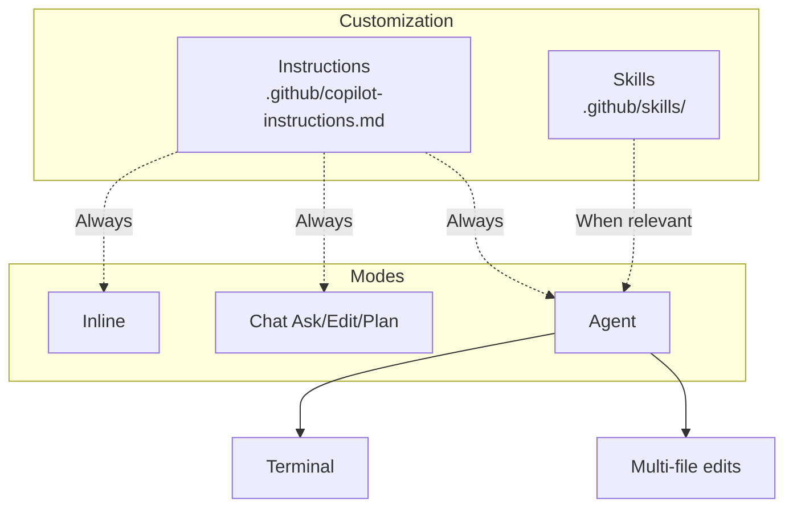

# Introduction — Developing in Python with GitHub Copilot

Welcome to the **GitHub Copilot** course for **Python**.

This course covers day-to-day GitHub Copilot usage: inline completions, Chat, repo customization and best practices for validating generated code.

## Audience and prerequisites

| Requirement | Detail |
| --------- | ------ |
| Development | Read and write code **Python** |
| Git / GitHub | GitHub account, repo and commit basics |
| Editor | Visual Studio Code (recommended) |
| Copilot | Active subscription (Individual, Business or Enterprise) |

## Overall objectives

- Use inline completions with precise prompts.
- Master Copilot Chat (Ask, Edit, Plan, Agent).
- Customize the repo with Instructions and Skills.
- Configure path-specific rules, commits and assisted reviews.
- Apply a validation checklist on generated code.

## Structure — 6 modules

| Module | Topic | Duration |
| ------ | ----- | ----- |
| 1 | Introduction to GitHub Copilot | 2 h |
| 2 | Inline completions and context | 3 h |
| 3 | Chat and interaction modes | 3 h |
| 4 | Agent, Skills and Instructions | 4 h |
| 5 | Path-specific, commit and review | 3 h |
| 6 | Best practices and productivity | 2 h |

Chaque module comprend un **lesson**, des **exercises** et une **solution**.


**Next step :** [Module 1 — Introduction](/formations/en-github-copilot-python/module-01-introduction)

---

# Module 1 — Introduction to GitHub Copilot

This module covers GitHub Copilot basics for **Python** development: what the tool is, which mode to use, and how to verify your VS Code setup.

**Estimated duration :** 2 h.

## Objectives

- Define GitHub Copilot and its role as a virtual pair programmer.
- Distinguish inline, Chat, Agent and CLI.
- Install and configure Copilot in VS Code.
- Review usage statistics.

---

> [!note] Definition — GitHub Copilot
> AI assistant in the editor. Analyzes **context** (files, comments, selection) and offers real-time **suggestions**.

## 1.1 What is GitHub Copilot?

GitHub Copilot is an AI-powered programming assistant developed by GitHub in collaboration with OpenAI. It works as a **virtual pair programmer** integrated directly into the code editor.

**How it works:**

- Copilot analyzes the context of code being written (open files, comments, variable names)
- It generates code suggestions in real time, directly in the editor
- The underlying model was trained on billions of lines of code from public GitHub repositories
- Il est particulièrement efficace en Python grâce à l'écosystème massif open source (Django, FastAPI, Flask, data science, automatisation, etc.)

**What Copilot is not:**

- Ce n'est pas l'interpréteur Python ni mypy/ruff
- It does not guarantee that generated code is correct or secure
- Il ne remplace pas la compréhension du langage Python et des bonnes pratiques PEP

## 1.2 Copilot versions — from inline completion to Agent

GitHub Copilot offers several **autonomy levels**. This course focuses on **Agent** mode and its customization (**Instructions**, **Skills**), while keeping **inline completions** for day-to-day typing.

| Version              | Autonomy level     | Description                                    | Primary use                             |
| -------------------- | ------------------ | ---------------------------------------------- | --------------------------------------- |
| **Copilot (inline)** | Low                | Code suggestions directly in the editor        | Day-to-day completion, boilerplate      |
| **Copilot Chat**     | Medium             | Conversation (Ask, Edit, Plan)                 | Questions, explanations, refactoring    |
| **Mode Agent**       | High               | Plans, edits multiple files, executes          | Multi-file tasks, debug, migration      |
| **Copilot CLI**      | Élevé              | Agent en ligne de commande                     | Shell, tests, CI, scripts               |

**Copilot inline** remains the entry point: as soon as you type code, suggestions appear in grey (`Tab` to accept). See **Module 2**.

**Copilot Chat** covers Ask, Edit, Plan and Agent. See **Module 3**.

**Instructions, Skills and Agent mode**: see **Modules 4 and 5**.

**Copilot CLI** (`gh copilot`) reprend la logique agentique hors de l'éditeur — utile pour lancer les tests (`pytest`), typer (`mypy`) ou formater (`ruff format`).

## 1.3 Installation and configuration

**Prerequisites:**

- A GitHub account with an active Copilot subscription (Individual, Business or Enterprise)
- Visual Studio Code installed
- Extension **Python** de Microsoft + **Pylance** (typage et IntelliSense)

**Installation steps:**

1. Open VS Code
2. Go to Extensions (`Ctrl + Shift + X`)
3. Search for "GitHub Copilot" and install the extension
4. Also install "GitHub Copilot Chat"
5. Sign in to GitHub when VS Code prompts you
6. Check the Copilot icon in the status bar (bottom)

**Verifying it works:**
Create a `test.py` file and start typing:

```python
def greet(name: str) -> str:
    """Affiche un message de bienvenue."""
```

If Copilot is working, a suggestion should appear in grey to complete the function.

## 1.4 Interface and usage statistics

To view Copilot usage statistics:

- Click the Copilot icon in the VS Code status bar
- Access the dashboard via GitHub: `Settings > Copilot > Usage`
- Available metrics: suggestion acceptance rate, lines of code generated, most used languages

In enterprise environments (Copilot Business/Enterprise), administrators have access to a detailed dashboard showing usage percentage by team and developer.

---

---

---

# Module 2 — Inline completions and context

In [module 1](/formations/en-github-copilot-python/module-01-introduction) we set up Copilot. **Inline completions** speed up Python boilerplate (utility functions, tests). This module covers shortcuts, context and comment-prompts.

**Estimated duration :** 3 h.

## Objectives

- Master inline suggestion keyboard shortcuts.
- Explain the context window and its limits.
- Write comment-prompts (What / How / Constraints).
- Iterate: alternatives, partial accept, rephrase.

---

**Inline completions** are the most used mode day to day. Once **Instructions** are configured (Module 4), they produce suggestions aligned with project Python standards.

> [!note] Definition — Inline completion
> Suggestion shown **in grey** while typing. Accept (`Tab`), reject (`Esc`) or browse alternatives.

## 2.1 Essential keyboard shortcuts

| Action                           | Shortcut (Windows/Linux)  | Shortcut (Mac)  |
| -------------------------------- | ------------------------- | --------------- |
| Accept suggestion                | `Tab`                     | `Tab`           |
| Reject suggestion                | `Esc`                     | `Esc`           |
| Next suggestion                  | `Alt + ]`                 | `Option + ]`    |
| Previous suggestion              | `Alt + [`                 | `Option + [`    |
| Accept next word                 | `Ctrl + →`                | `Cmd + →`       |
| Trigger manually                 | `Alt + \`                 | `Option + \`    |
| Open suggestions panel           | `Ctrl + Enter`            | `Ctrl + Enter`  |

The suggestions panel (`Ctrl + Enter`) opens a window with up to 10 alternative suggestions. Useful when the first suggestion is not suitable.

## 2.2 Triggering suggestions

### Start typing a function signature

```python
def calculate_factorial(n: int) -> int:
```

Copilot will suggest the function body based on the explicit name and types.

### Write a descriptive comment

```python
def bubble_sort(arr: list[int]) -> list[int]:
    """Tri à bulles, retourne une nouvelle liste triée."""
```

The comment guides Copilot on the expected algorithm.

### Create a data structure

```python
@dataclass
class Employee:
    name: str
    age: int
    salary: float
```

Copilot pourra suggérer des méthodes cohérentes (__str__, from_dict, to_dict, etc.).

### Use explicit variable names

```python
max_retry_count = 3
error_message: str | None = None
input_file = open("data.csv", encoding="utf-8")
```

Clear variable names help Copilot understand the code intent.

## 2.3 Context matters

Copilot does not rely only on the current line. It analyzes a **broader context**:

**Files open in the editor:**
Si vous avez `models.py` ouvert avec des dataclasses, Copilot les utilisera pour générer des services cohérents dans `services.py`.

**Imports influence suggestions:**

```python
from fastapi import APIRouter      # Copilot suggère des endpoints REST
import pandas as pd               # Copilot suggère du traitement de données
import asyncio                    # Copilot suggère du code async
```

**Surrounding code guides generation:**
Si les fonctions précédentes utilisent un style particulier (gestion d'erreurs, patterns async, immutabilité), Copilot va reproduire ce pattern.

```python
# Si votre code existant fait ceci :
try:
    result = fetch_data(url)
except RequestError as exc:
    logger.error("Échec requête %s: %s", url, exc)
    raise

# Copilot reproduira ce pattern de gestion d'erreur
```

## 2.4 The context window

The **context window** is the maximum amount of text — code, comments, chat history, project instructions — the model can process **in a single request**.

**Concrete definition:**

- Everything Copilot "sees" before responding occupies this window: open files, selection, chat messages, `@workspace`, Copilot instructions, etc.
- This limit is measured in **tokens** (text chunks), not lines of code.
- Beyond the limit, the oldest or lowest-priority content is **truncated**.

**Why it matters:**

| Consequence                       | Explanation |
| --------------------------------- | ----------- |
| **Context loss**                  | A large file + chat history can make Copilot "forget" the beginning. |
| **Less consistent suggestions**   | If your conventions no longer fit in the window, Copilot falls back to generic patterns. |
| **Incomplete Agent responses**    | On a large repo, the agent must target the right files. |
| **Prompt quality trade-off**      | Relevant context beats large context. |

**Best practices to optimize the window:**

- Keep only **relevant** files open (ex. `models.py` + `services.py`, pas tout le projet).
- Ask **focused** questions in chat rather than pasting thousands of lines.
- Utiliser `#file:src/services/parser.py` pour un fichier précis plutôt que `#workspace` quand la question est locale.
- Break large refactors into steps (module by module).
- Centralize project rules in **Instructions** (see Module 4).

## 2.5 The art of comment-prompts

In Python, docstrings and type hints guide Copilot.

**Vague comment → imprecise result:**

```python
# sort the array
```

**Precise comment → targeted result:**

```python
def insertion_sort(arr: list[int]) -> list[int]:
    """Tri par insertion, ordre croissant. O(n²) pire cas. Retourne une copie."""
```

## 2.6 Core principles

**Be specific and precise:**

```python
# ❌ Vague
# lire un fichier

# ✅ Précis
def read_lines(file_path: str) -> list[str]:
    """Lit un fichier texte ligne par ligne. Lève FileNotFoundError si absent."""
```

**Provide context:**

```python
def find_free_block(size: int) -> memoryview | None:
    """Recherche un bloc libre dans la free list (stratégie first-fit)."""
```

**Break down complex problems:**

```python
def parse_csv_line(line: str) -> list[str]: ...
def token_to_employee(tokens: list[str]) -> Employee: ...
def insert_employee(employees: list[Employee], emp: Employee) -> list[Employee]: ...
```

**Iterate on suggestions:**
If the first suggestion is not suitable, use `Alt + ]` to browse alternatives, or rephrase the comment.

## 2.7 Structure of a good prompt

An effective prompt follows the **What / How / Constraints** structure:

```python
def binary_search(arr: list[int], target: int) -> int:
    """
    WHAT: Recherche dans un tableau trié
    HOW: Dichotomie
    CONSTRAINTS: arr trié croissant ; retourne l'index ou -1
    """
```

Another example:

```python
def deep_copy_list(head: Node | None) -> Node | None:
    """
    WHAT: Copie profonde d'une liste chaînée
    HOW: Parcours itératif, nouveaux nœuds
    CONSTRAINTS: retourne None si head est None ; pas de mutation de l'original
    """
```

## 2.8 Iteration and refinement

**Partially accept a suggestion:**
Use `Ctrl + →` (accept word by word) when the start of the suggestion is good but the rest diverges.

**Modifier et relancer pour affiner :**

```python
# Premier essai — bubble sort basique
# Trier un tableau

# Deuxième essai — plus précis
def quicksort(arr: list[int]) -> list[int]:
    """Quicksort, pivot médian, fallback insertion si len < 10."""
```

**Combiner plusieurs suggestions :**
Accepter une suggestion pour le squelette, puis supprimer certaines parties et redemander avec un commentaire plus spécifique.

---

---

---

# Module 3 — Chat and interaction modes

After [inline completions](/formations/en-github-copilot-python/module-02-completions-inline), this module covers **Copilot Chat** to debug and plan Python refactorings.

**Estimated duration :** 3 h.

## Objectives

- Use Ask, Edit, Plan and Agent modes.
- Select context (@workspace, #file, selection).
- Use slash commands (/explain, /fix, /tests).
- Understand semantic codebase indexing.

---

## 3.1 Chat modes — Ask, Edit, Plan, Agent

Copilot Chat offers several **modes** depending on the desired autonomy level. They share project **Instructions**; only **Agent** and partially **Ask** use **Skills** (see Module 4).

| Mode       | Autonomy  | Behavior                                          | Python example                          |
| ---------- | --------- | ------------------------------------------------- | ------------------------------------------------- |
| **Ask**    | Low       | Answers, explains, does not modify files          | « Explique ce décorateur et son ordre d'application »           |
| **Edit**   | Medium    | Modifies selected code or active file              | « Ajoute les type hints manquants sur cette fonction »     |
| **Plan**   | Medium    | Produces a detailed plan before acting            | « Plan pour migrer ce module vers async/await »  |
| **Agent**  | High      | Plans, edits, executes, iterates                  | « Corrige toutes les erreurs mypy sur src/ »    |

**Ask** — understand code without modification:

- Select a block, ask a question: « Pourquoi j'ai une RecursionError ici ? »
- Les Instructions s'appliquent (ex. réponse alignée sur vos conventions docstring Google/NumPy)

**Edit** — localized changes:

- Select a function, request « /fix » or a targeted change
- Faster than Agent for a one-off change

**Plan** — large tasks:

- Copilot produces a numbered plan; you validate before switching to Agent

**Agent** — core of the agentic approach (see Module 4):

- Terminal access, multi-file, semantic index
- Automatically activates relevant **Skills**

## 3.2 Chat interface

Open the Chat panel: `Ctrl + Shift + I` (or `Cmd + Shift + I` on Mac).

**Useful Python questions:**

- "Explique-moi ce générateur et son yield"
- "Pourquoi ce dataclass n'est pas hashable ?"
- "Comment implémenter un endpoint FastAPI avec validation Pydantic ?"
- "Génère les tests pytest pour cette fonction"
- "Optimise cette boucle pandas pour réduire les copies"

**Get detailed explanations:**
Select a complex code block then ask in chat:
"Explique ce code étape par étape, en particulier la gestion des exceptions et les type hints"

## 3.3 Slash commands

| Command    | Action                                              |
| ---------- | --------------------------------------------------- |
| `/explain` | Explains the selected code                          |
| `/fix`     | Suggests a fix for the selected code                |
| `/tests`   | Generates tests for the selected code               |
| `/doc`     | Génère la documentation (docstrings Google ou NumPy) |
| `/new`     | Creates a new file/project                          |
| `/clear`   | Clears chat history                                 |

**Example with `/doc` :**

```python
def add_node(linked_list: LinkedList, data: object) -> int:
```

```python
def add_node(linked_list: LinkedList, data: object) -> int:
    """
    Ajoute un nœud en tête de la liste chaînée.

    Args:
        linked_list: Liste cible.
        data: Données à stocker.

    Returns:
        Index du nœud créé, ou -1 en cas d'erreur.
    """
```

## 3.4 Context selection

Highlight a code block, then open chat → Copilot understands the question is about that specific code.

## 3.5 Semantic codebase indexing

**Semantic indexing** lets Copilot **understand the meaning** of project code, not just match keywords.

**Principle:**

- The repository is analyzed as embeddings: functions, types, comments, relationships between files.
- A question like "Where is validation handled?" or `@workspace find duplicate handlers` relies on this index.
- Relevant results are injected into the context window.

| Approach                          | Limit |
| --------------------------------- | ------ |
| Open files + current line         | Only covers what you have on screen |
| Symbol name search                | Misses implementations under another name |
| **Semantic index**                | Finds code by **intent** (« parsing CSV », « session SQLAlchemy », « gestion d'erreur HTTP ») |

**Best practices:**

- Let indexing finish after a clone or large pull.
- Formulate queries with **concepts** (« dataclass », « générateur », « context manager »).
- Combiner index sémantique + `#file:src/services/parser.py`.

## 3.6 Agent mode in practice

**Agent mode** is where **Skills** and **Instructions** configured in Module 4 are applied.

Copilot can:

- Run terminal commands (`pytest`, `mypy`, `ruff check`, `python -m`)
- Modify multiple files in sequence
- Iterate until the problem is solved or report a blocker

```
Mode Agent : « Corrige toutes les erreurs mypy et ruff sur src/ »
→ Copilot active le skill type-and-lint (si présent)
→ Applique les Instructions (PEP 8, type hints)
→ Lance mypy et ruff, corrige les fichiers, relance pytest
```

**Agent best practices:**

- State a **measurable goal** (« 0 erreur mypy et ruff sur src/ »)
- Let semantic indexing finish on large repositories
- Manually review the diff before commit

## 3.7 Cloud mode (overview)

Cloud mode runs Copilot tasks on GitHub infrastructure:

- Long-running background tasks
- No need to keep VS Code open
- Results via notification or PR
- Useful for large refactors or migrations

---

---

---

# Module 4 — Agent, Skills and Instructions

In [module 3](/formations/en-github-copilot-python/module-03-chat-modes) we explored Chat. This module covers **agent customization**: Instructions, Skills and Agent mode.

**Estimated duration :** 4 h.

## Objectives

- Write `.github/copilot-instructions.md` for a Python project.
- Create a domain Skill (lint, tests, typecheck).
- Understand the Instructions → Skills → Agent flow.
- Test customization in Agent mode.

---

> [!note] Definition — Instructions
> **Permanent** repo rules injected on every interaction. Main file: `.github/copilot-instructions.md`.

> [!note] Definition — Instructions
> **Permanent** repo rules injected on every interaction. File: `.github/copilot-instructions.md`.

## 4.1 Overview

| Concept | Role | When active | Typical file |
| ------- | ---- | ----------- | -------------- |
| **Instructions** | Permanent project rules | **Always** (inline, chat, agent) | `.github/copilot-instructions.md` |
| **Skill** | Specialized workflow, loaded on demand | When the task matches the description | `.github/skills/<name>/SKILL.md` |
| **Agent** | Autonomous mode that plans and executes | On explicit request (Agent mode) | Chat panel or Copilot CLI |

**Instructions** define _how to code in this repo_. **Skills** teach _how to accomplish a recurring task_. **Agent** _orchestrates_ both.

| | Instructions | Skill |
| --- | --- | --- |
| **Content** | Short rules, project standards | Detailed workflow, scripts, references |
| **Activation** | Always | Only when the task is relevant |

## 4.2 Global Instructions — `.github/copilot-instructions.md`

File at the repository root (`.github/` folder). Copilot injects it in **every** interaction.

| File | Scope |
| ---- | ----- |
| `.github/copilot-instructions.md` | Global — entire repo |
| `.github/instructions/*.md` | Path-specific (`applyTo` in YAML header) |
| Personal instructions | GitHub → Settings → Copilot (all your projects) |

**Example:**

```markdown
# Instructions — Python project

- Python 3.11+ ; type hints on public API
- snake_case functions/variables ; PascalCase classes
- Google-style docstrings on public functions
- `pytest` for tests ; `ruff` for lint
- Check implicit `None` returns and documented exceptions
```

**Best practices:**

- Keep it **short** (≤ 200 lines) — details belong in a Skill or path-specific instruction (module 5).
- Document _why_ a rule exists, not only _what_.
- Pedagogical rules: do not complete exercise stubs for students.

> Instructions stay **general**. For a detailed workflow, prefer a **Skill**.

## 4.3 Skills — `.github/skills/<name>/SKILL.md`

> [!note] Definition — Skill
> Folder with `SKILL.md` (`name`, `description` in YAML frontmatter). Copilot loads the skill **when the task matches** the YAML description.

**Structure:**

```
.github/skills/
└── lint-and-check/
    ├── SKILL.md
    ├── scripts/
    └── references/
```

**Example `SKILL.md`:**

```markdown
---
name: lint-and-check
description: Runs ruff and pytest. Use when the user mentions lint, pytest, mypy or test failure.
---

## Workflow

1. `ruff check .` then `mypy src/`
2. `pytest` on the target package
3. Fix imports and types
4. Iterate until clean
```

| Action | Documentation |
| ------ | ------------- |
| Create a skill | [About agent skills](https://docs.github.com/en/copilot/concepts/agents/about-agent-skills) |
| Repository instructions | [Repository custom instructions](https://docs.github.com/en/copilot/customizing-copilot/adding-repository-custom-instructions-for-github-copilot) |

## 4.4 Agent mode in practice

**Agent mode** (Module 3) applies the Instructions and Skills configured above.

**Capabilities:**

- Run terminal commands (`pytest, ruff check, mypy`)
- Edit multiple files in sequence
- Iterate until a measurable goal is met or report a blocker

**Example:**

```
Agent mode: "Fix all ruff and mypy errors under src/"
→ Runs ruff and pytest, fixes, re-runs
```

**Best practices:**

- **Measurable** goal ("0 gcc warnings", "green tests")
- Review the diff before commit
- Let semantic indexing finish on large repos

## 4.5 Architecture diagram



## 4.6 Minimal setup

1. **Global Instructions** — `.github/copilot-instructions.md`
2. **Test instructions** — `.github/instructions/tests.md` with `applyTo: "**/test_*.py,**/*_test.py"`
3. **One domain skill** — `.github/skills/lint-and-check/SKILL.md`
4. **Test in Agent** — `@workspace Fix ruff and mypy errors under src/`

## 4.7 Reusable prompts (optional)

`.github/prompts/*.prompt.md` — templates for recurring requests (complement to Skills).

```markdown
<!-- .github/prompts/new-module.prompt.md -->
Create a new module with:
- `__init__.py` exporting the public API
- Types in `types.py` or dedicated module
- pytest tests in `tests/`
```

---

# Module 5 — Path-specific, commit and review

In [module 4](/formations/en-github-copilot-python/module-04-agent-skills) we set global Instructions. This module shows how to refine Copilot **per repo area**: API, tests and Python source follow different rules.

**Estimated duration :** 3 h.

## Objectives

- Configure path-specific instructions (applyTo).
- Create advanced Skills with scripts.
- Generate commit messages with Copilot.
- Run an assisted code review.

---

The **Agent**, **Skill** and **Instruction** concepts are covered in **Module 4**.

## 5.1 Path-specific instructions

**Path-specific** instructions activate only when Copilot works on files matching a **glob**.

**Why use them:**

- L'API FastAPI (`src/api/`) n'a pas les mêmes règles qu'un script CLI (`scripts/`)
- Les tests (`tests/`) peuvent autoriser des fixtures/mocks interdits en production
- Les notebooks (`notebooks/`) vs code source (`src/`) demandent des consignes distinctes

**Recommended organization:**

```markdown
---
applyTo: "src/**/*.py"
---

# Règles pour le code source Python

- Type hints sur les signatures publiques
- snake_case, docstrings Google
- Pas de bare except, préférer pathlib
```

```markdown
---
applyTo: "tests/**/test_*.py"
---

# Règles pour les tests

- pytest uniquement, pas unittest sauf legacy
- Utiliser les fixtures de conftest.py
- Un fichier test_<module>.py par module testé
```

```markdown
---
applyTo: "exercices/**/*.py"
---

# Context pédagogique — exercices étudiants

- Laisser les blocs TODO intacts
- Suggérer des indices en commentaire plutôt que des solutions complètes
- Respecter les noms de fonctions imposés par l'énoncé
```

**Priority order:**

1. Global Instructions
2. Path-specific instructions (matching glob)
3. Immediate context (file, selection, comment-prompt)

**Best practices:**

- Prefer **narrow** globs (`src/services/*.py`) à `**/*`
- Document _why_ each rule exists
- Ensure a global rule does not override a local one

**Create advanced Skills:**

- Scripts dans `scripts/` (wrapper `ruff check` avec options du projet)
- Doc lourde dans `references/` pour préserver la fenêtre de contexte
- Refine the YAML `description` — the **trigger** for selection

## 5.2 Reusable prompts (`.github/prompts/`)

```markdown
<!-- .github/prompts/new-module.prompt.md -->

Crée un nouveau module Python avec :

- `__init__.py` exportant l'API publique
- Types dans `types.py` ou annotations inline
- Tests pytest dans `tests/test_<module>.py`
- Docstrings Google sur chaque export public
```

## 5.3 Automated commits

- Click the Copilot icon in Source Control
- Copilot analyzes the diff and suggests a message (Conventional Commits if configured)

Exemple :

```
feat(parser): add CSV parsing with quoted field support

- Handle escaped quotes within fields
- Support multiline values enclosed in quotes
- Add error reporting with line numbers
```

## 5.4 Code review on pending commits

- Source Control → "Review Changes" with Copilot
- Particulièrement utile en Python pour détecter :

- Injections SQL ou commandes shell via entrées utilisateur
- Usage de `eval`, `pickle` ou désérialisation non sûre
- Mutabilité par défaut (arguments list/dict mutables)
- Secrets ou tokens en dur dans le code

## 5.5 Fine-tuning and customization

- **Instructions** (Module 4) influence all suggestions
- **Skills** standardize recurring workflows
- Copilot learns patterns from existing code in the repository

---

---

---

# Module 6 — Best practices and productivity

In [module 5](/formations/en-github-copilot-python/module-05-path-specific-review) we refined governance. This closing module covers **when** to trust Copilot and **how** to validate generated Python code.

**Estimated duration :** 2 h.

## Objectives

- Apply a validation checklist on generated code.
- Identify suitable (and unsuitable) Copilot use cases.
- Adopt a sustainable productivity workflow.
- Formalize team best practices.

---

## 6.1 Validating generated code

Python code generated by Copilot requires particular attention:

**Always verify:**

- Les type hints et cas None
- La gestion des exceptions (pas de bare except)
- Les effets de bord (mutabilité des listes/dicts par défaut)
- La concurrence (asyncio, GIL, race conditions)
- La sécurité (injection, secrets, désérialisation)

**Validation tools:**

```bash
# Typage statique
mypy src/

# Lint et format
ruff check src/
ruff format --check src/

# Tests
pytest
```

## 6.2 When to use Copilot

**Repetitive or boilerplate code:**

```python
# Copilot excelle pour générer des fonctions CRUD similaires
def create_employee(data: CreateEmployeeDto) -> Employee: ...
def update_employee(emp_id: str, data: UpdateEmployeeDto) -> Employee: ...
def delete_employee(emp_id: str) -> None: ...
def get_employee_by_id(emp_id: str) -> Employee | None: ...
```

**Classic algorithms, tests, API exploration:**
Copilot connaît les implémentations standards et le boilerplate (FastAPI, SQLAlchemy, pandas, asyncio).

**Unit tests:**

```python
# Demander : "Génère les tests pytest pour binary_search"
def test_binary_search_found():
    assert binary_search([1, 3, 5, 7, 9], 7) == 3

def test_binary_search_not_found():
    assert binary_search([1, 3, 5, 7, 9], 4) == -1
```

## 6.3 When to be cautious

**Security-critical code:** always review and test thoroughly.

**Complex business logic:** Copilot may produce syntactically correct but semantically wrong code.

**Contraintes spécifiques :** embarqué, notebooks production, contraintes mémoire — Copilot ne connaît pas toujours le contexte d'exécution.

**Performance critique :** Copilot génère du code fonctionnel mais rarement optimal. Pour du NumPy/pandas intensif ou des boucles critiques, l'expertise humaine reste indispensable.

## 6.4 Optimal productivity

- Read and understand each suggestion before accepting it
- Copilot speeds up writing; it does not replace thinking
- Observer les suggestions pour découvrir des idiomes (découvrir `itertools`, `functools.lru_cache`, les dataclasses via les suggestions)

**Adapt your workflow progressively:**

1. **Inline completions** — boilerplate (Module 2)
2. **Chat Ask/Edit** — debugging and documentation (Module 3)
3. **Instructions** — `.github/copilot-instructions.md` (Module 4)
4. **Skills** — recurring workflow (Module 5)
5. **Agent mode** — multi-file tasks with diff review

---
